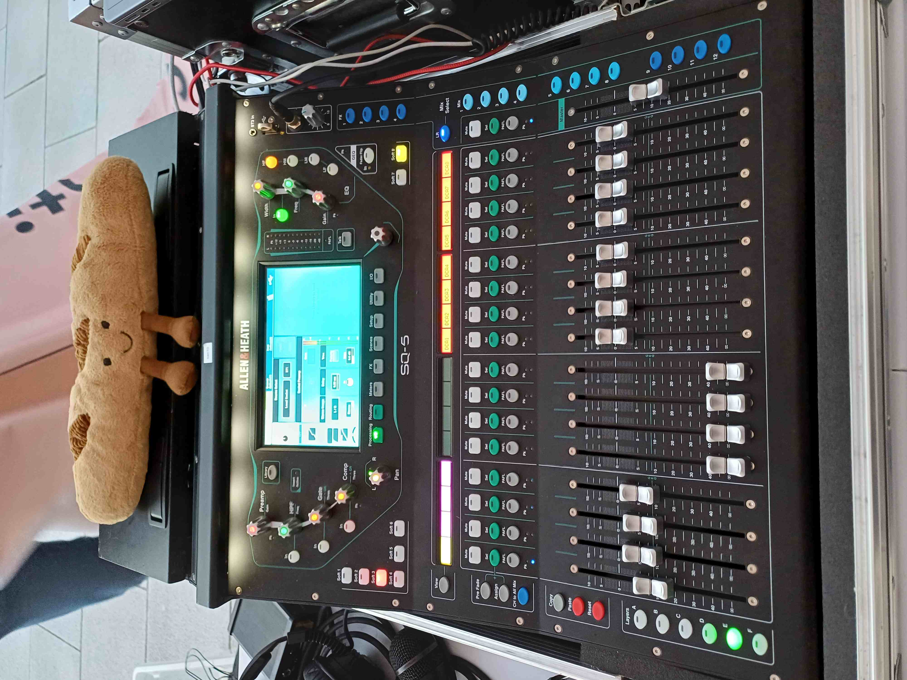
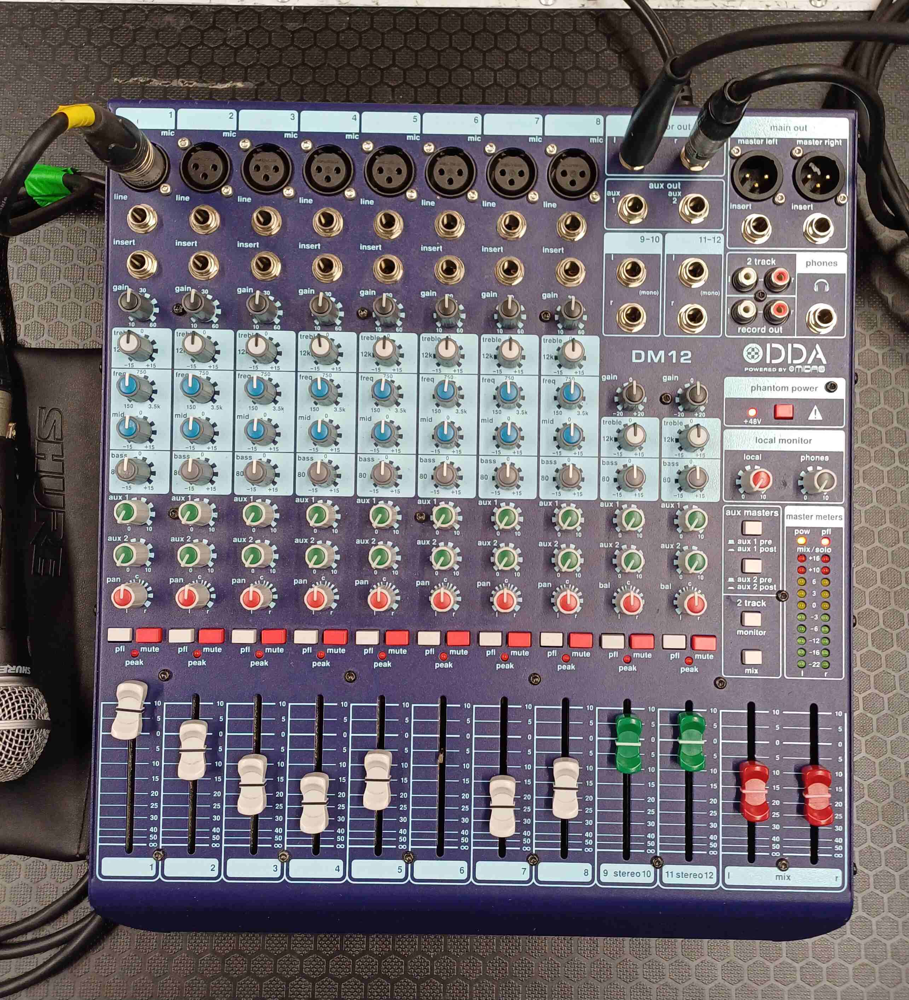
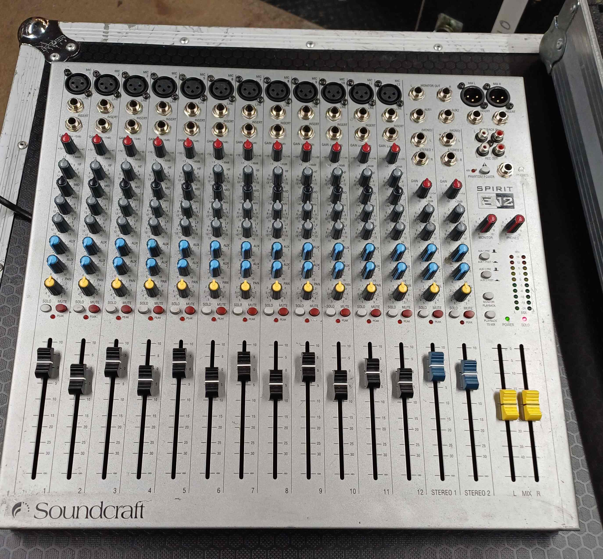
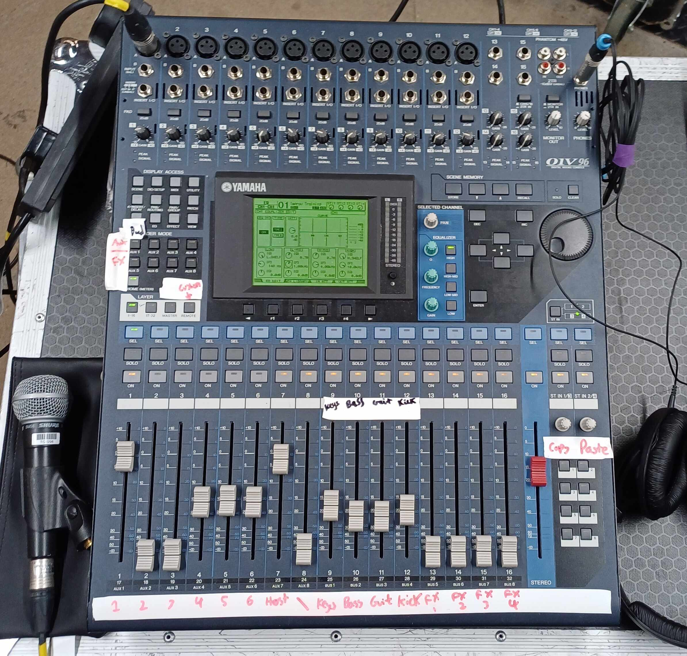

# Sound Desks

## [Allen&Heath SQ5](https://www.allen-heath.com/hardware/sq/)

This is the fanciest sound desk that Tech Crew own! It's a digital mixing desk that can handle 48 channels, 16 preamps
and 12 line outputs. The tech crew iPad can be used to
[mix this desk remotely](/wiki/disciplines/general/networking#sq5-audio-mixer) while walking around the venue. The desk
has dedicated knobs for all processing which makes it quick to navigate and use during live mixing. This is the desk we
use for MTW improv and all substantial sound activities outside of WAC!

:::warning

Our SQ5 does not yet have a dante expansion card! So you'll need to stick to USB input for playback, or use the WAC's
S21 instead.

:::

## [DiGiCo S21](https://digico.biz/consoles/s21/)

This is the desk found all over WAC. 48 channels, 16 onboard preamps, 12 outputs. You can request for one with a Dante
card. See its [datasheet](https://digico.biz/wp-content/uploads/2020/04/DiGiCo-S21-Data-Sheet-1.pdf)!

## Midas DM12

One of the two analogue sound desks we own!

8 Mono XLR inputs, 2 Stereo jack inputs, 2 Auxes and a Main LR out. This is a lovely little desk, its super lightweight
and portable with a minimal layout. This desk has two insert slots which can supposedly be used for an outboard FX rack,
however you need some special jack-jack splitter for the input and output that I couldn't work out. The approach that
worked for me was sending channels to the outboard FX using one of the auxes, then taking the FX return back into the
desk through one of the stereo input channels (green fader). Sadly the channel 6 fader cap has despawned :(

## Soundcraft Spirit E12

Our second analogue desk, with four extra inputs, and the capability for any channel to be either stereo or mono!

## Yamaha O1V96

This desk has a little LCD digital display. This desk is in the middleground between our more powerful digital SQ5, and
our simpler analogue desks. Personally, I can't see a use case for this desk, given that we have analogue desks (the
DM12) which are better for teaching on and are more portable for small very simple hires, and we have the SQ5 which is
easier to use, more modern and more powerful, while also being in a wheeled flightcase which is easier to transport.
O1V96 enjoyers feel free to edit this page in defence !

## Glossary

### Channels

The number of _channels_ in a sound desk represents the number of simultaneous inputs that the desk can process at a
time. For example a 48 channel desk could handle 12 cast radiomics + 8 drum mics + 14 orchestra mics + 2 offstage mics +
4 boundary mics + 5 FX groups + 2 playback channels + 1 god mic, channels get used up fast!

### Preamps

The number of _preamps_ on a desk/stagebox is the number of weak, unamplified, "mic-level" signals (such as the signal
from a normal microphone) that the desk/stagebox can lift up to a "line-level" signal suitable to be processed by a
desk.

:::note

The number of preamps on the desk is normally much lower than the total number of channels a desk can handle! For
example, once you've used up the 16 SQ5 onboard preamps, you'll have to find other ways (stagebox's preamp, soundcard,
etc) to provide line level signal to the remaining 32 channels.

:::

:::info

The signal from a microphone is produced by movement in a tiny diaphram that vibrates due to the sound pressure waves
from the source. This signal is weak and contains background noise, it isn't able to unable to undergo processing (fx,
compression etc) from a sound desk unless it is first brought up to a higher amplitude by a preamp.

:::
