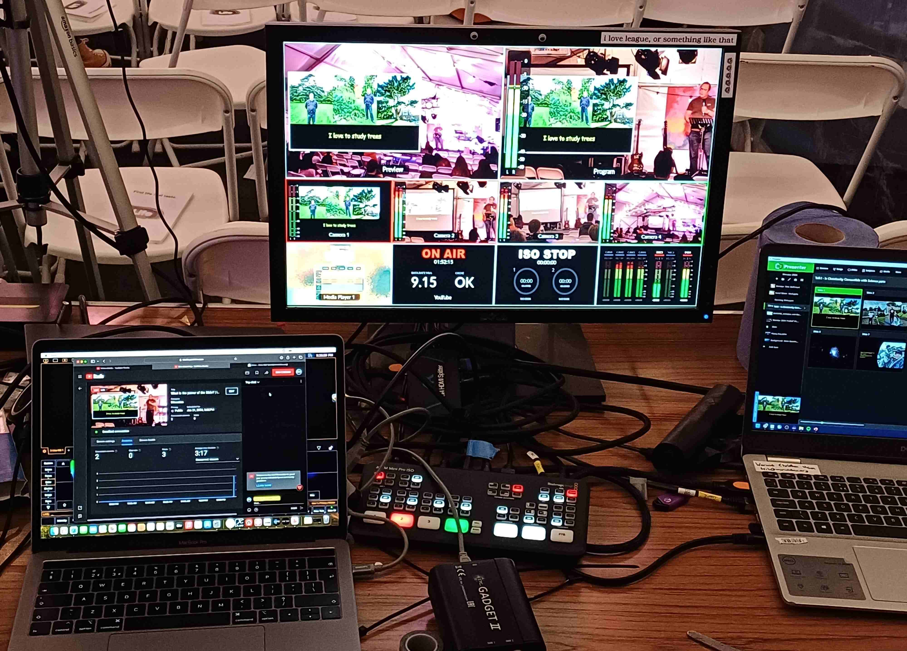

# Video

<figure>

<figcaption>The streaming setup for the CU Wonder hire 24/25</figcaption>
</figure>

:::info
Information about a Video Designer's responsibilities throughout the show process can be found on the
[Shows](/wiki/warwick-drama/shows) pages.
:::

There are two main cases you would want to add video to a show, either livestreaming the show (for example WSAF, XMAS Lights Switch On) or to record it.

## ToDo: write the rest of this

## Drones
:::warning
To take off a drone from warwick grounds you need a permit, this recquires a staff account and .... (Josh pls insert)
:::
If you do not require a live feed from the drone, just use the built in recording feature to an SD card and save yourself hassle of what is about to come.

Live recording, strap yourself in. So, for most DJI drones the only supported live output is to an [RTMP Server](https://en.wikipedia.org/wiki/Real-Time_Messaging_Protocol). For this you will need the drone and a laptop/pc on the same network (I would advise not using eduroam). To set up an rtmp server on a computer, use either [MonaServer](https://www.reddit.com/r/mevocamera/comments/bd5182/how_do_i_turn_my_pc_into_a_local_rtmp_server_so/) for Windows or [MistServer](https://docs.mistserver.org/protocol/realtimestreaming/rtmp/) for MacOS/Linux. Then set the url of the rtmp server on the drone. To easily view the state of the rtmp server, use [VLC](https://www.videolan.org/) and its network view feature (Media->Open Network Stream). Once you have a reliable stream, this can be imported to [OBS](https://obsproject.com/) using the dedicated import (Sources->Add->VLC Video Source). Note this requires a fast WiFi network to run reliably with a high quality, test beforehand!

The other method of live recording is to get an output straight from the controller. Most controllers unfortunately cannot do this, as of writing the known ones are [DJI RC2](https://dji-retail.co.uk/products/dji-rc-2-remote-controller-with-screen) or [DJI RC pro](https://www.dji.com/uk/rc-pro). The pro is nice as it has a dedicated hdmi out. The RC2 requires a USB C to HDMI adaptor, and then a HDMI cable. Note you cannot use soley USB-C as the video cable as the controller will not recognise that as a video output. Once you have video out, it mirrors the stream of the controller, meaning all cropping is added, so you may need to pass the input through OBS to crop the stream to remove them.
