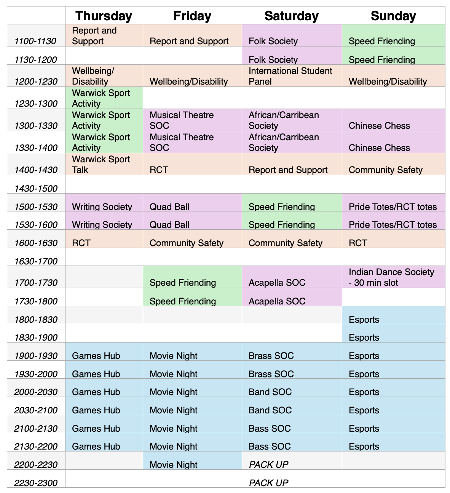
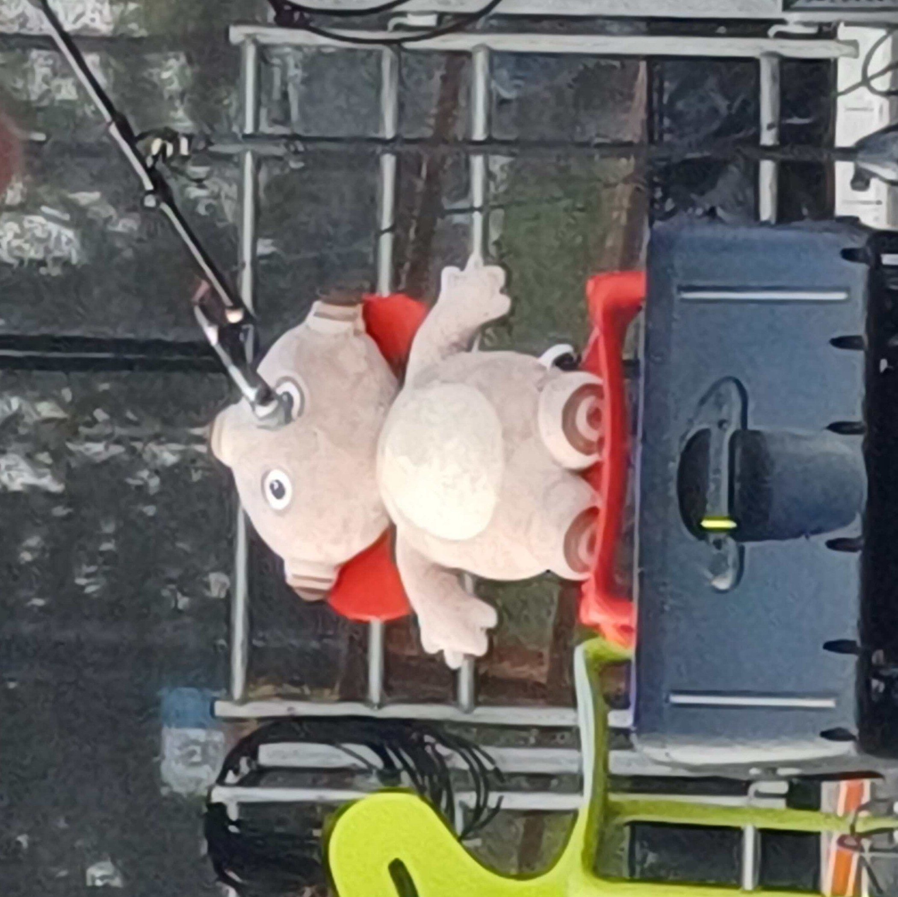
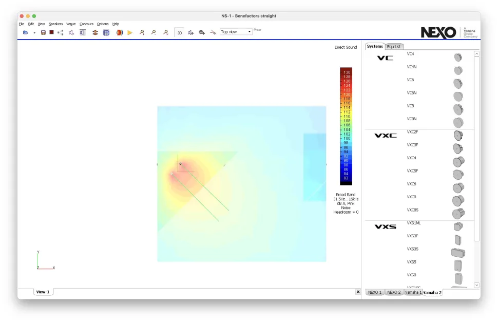
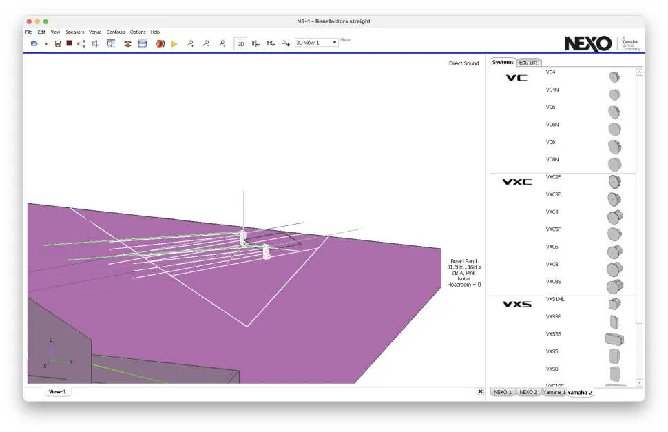
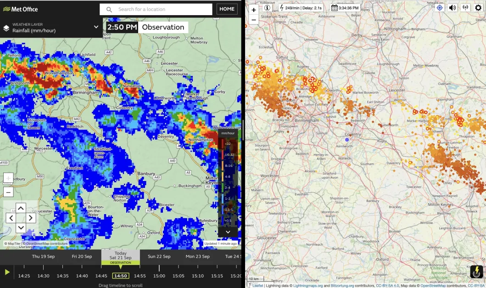

# Arrivals Stage 2024

In July 2024, we responded to [Residential Community Team](https://warwick.ac.uk/services/rescommunity/rct/) email about their Arrivals week stage.
We offered to provide tech and operators for the event for them. Warwick Presents organised the hire of a [Stage Tech ST130 5x5x6m stage](https://www.stagetecheventhire.co.uk/small-trailer-stage.html), which we rigged with basically all of our lights and speakers.
The event get in was Wednesday 18th Sep 2024, and events ran for the following 4 days.

<figure>

<figcaption>The Arrivals Stage 2024 team on Saturday night</figcaption>
</figure>

We had performances from Folk soc, African and Caribbean Society, Acapella, MTW, Brass, Band soc, Bass and panels from
community safety, report + support and more.

## Sound

### Speakers

This was the first proper usage of the [Tech Crew Line array](https://www.nexo-sa.com/products/geo-s1210/).
Either side of the stage, we vertically stacked 4 segments of line array on top of hired [WAC subs](https://emacoustics.co.uk/docs/products/s-215/).
Each segment was set to an angle of 2º to the next, mounted at 0º to the inverted fixed installation flying mount.
During the get in, we noticed there were weird phasing and interference issues right near the barrier, which were fixed by setting the proper delay (6.1 m between arrays, ~18 ms).
However, sound directly in front of the stage was still quiet, so we used 2 of our LVX-8 speakers as front fill.
We used the last surviving [big mackie](https://mackie.com/en/products/loudspeakers/srm-portable/SRM450.html) as a center foldback, and the two [small mackies](https://mackie.com/en/products/loudspeakers/srm-portable/SRM350.html) as left and right foldbacks.
We ran sound from the SQ5 + stagebox, using our phones/ipad as monitor mixers using mixpad.

We ran simulations of the system using the manufacturers (nexo) [modelling software](https://www.nexo-sa.com/systems/software/).

   

### Side chain

During some of the activities (speed friending), we had a presenter that would call the activity, and backing music to play while the activity was underway.
We simplified the mixing and made the sound more consistent by side-chaining the music channel to the presenters mic.

Side chaining is a special type of compression:
Instead of the compressor responding to the volume of the sound it’s applied to, it responds to the volume of another signal or track (the "sidechain input", in this case the presenters mic).
So the music would play uncompressed when there was no signal from the presenter mic.
Then when the presenter starts talking, the side chain will activate because there is signal from the presenter mic, and the music channel would experience the compression and have its volume reduced automatically!

### Communications

We ran a line of cans from the tech tent, through the cable ramp, up to stage left and right.
The reasoning for this was because sound got bored during get in, but it turned out to be used frequently, for sound to talk to the stage tech setting up the on stage equipment!
The tech tent was two 2x2m RCT tents we commandeered and then stuck together.
People tripped over the cable ramp 30+ times (we kept track).

## Lighting

We utilised the tech crew lights including 2 lumipars, 6 cobs, 7 battens and 2 festoons (with two bulbs broken in get in). We also hired in 2 [Robe Spikies](https://www.robe.cz/spikie) and 2 Chauvet [Q Wash 419Z](https://www.chauvetprofessional.com/wp-content/uploads/2015/06/QWash419ZLED-CutSheet.pdf) (that definitely didn't break) from the SU.
The cobs were placed across the back as backlights, flanked by 2 battens clamped to the pillars either side.
On the middle bar we had the q washes before they mysteriously stopped working, before replacing them with the spikies once we actually got power cables for them for the SU.
We used four lumipars as facelights, did a proscenium arch that was made eintirely out of festoon and had the remaining 3 battens placed at the front of the stage facing into the audience.
To control the lighting we used the tech crew Zeroflx desk that also could control the hazer and bubble machine through the use of a dimmer rack.
All but 1 fader on the desk was in use at some point during the arrivals stage.

## Rain

Watching both the [met office rainfall radar](<https://www.metoffice.gov.uk/weather/maps-and-charts/rainfall-radar-forecast-map#?search=Coventry%20(West%20Midlands%20Conurbation)&slatlong=52.40648031234741%2C-1.5181946754455566&sgeohash=gcqfjkq3z&model=ukmo-ukv&layer=rainfall-rate&bbox=[[51.58901622923168,-4.155578613281251],[53.207677555890015,1.1178588867187502]]>) and a [real time lightning map](https://www.lightningmaps.org/?lang=en#m=oss;t=3;s=0;o=0;b=;ts=0;) we tracked the storm that was coming in.
When the rain came in, we covered the foldbacks with RCT branded tarp.
Water started seeping in through the gap between the two tents dripping over our electrics.
This all happened during playback of our rain playlist, with tracks such as its raining men, singing in the rain, finishing off with here comes the sun as the clouds broke.
The squeegee was used!

## Publicity

This was the first time tech crew used a roll up banner!
We had loads of people come up to the tech tent asking what we do.
Our lovely publicity officers created a banner design and flyers over the summer, which were printed off and displayed around the tech tent.
This was a great way to drum up attendance to our welcome week events!

  <iframe
    src="https://www.youtube.com/embed/yg9dulfQpjw?si=hPr4i0ljPjCWlblW"
    title="YouTube video player"
    frameborder="0"
    allow="accelerometer; autoplay; clipboard-write; encrypted-media; gyroscope; picture-in-picture; web-share"
    referrerpolicy="strict-origin-when-cross-origin"
    allowfullscreen
  ></iframe>

