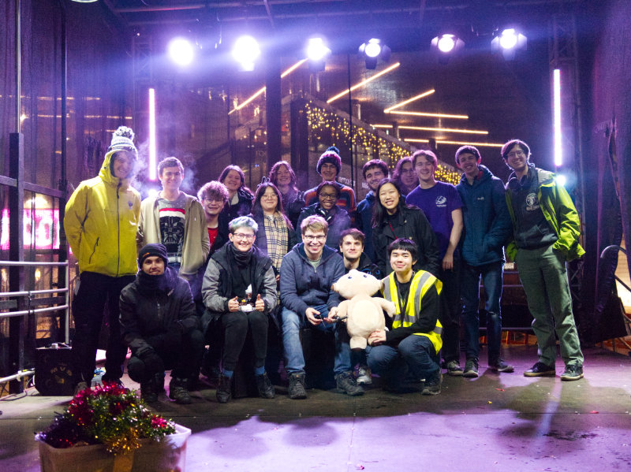

# Christmas Lights Switch-on 2024
(On November 27th, 2024)

The Warwick Christmas Lights Switch-on project was organised by a group of university departments, spearheaded by Olivia
from the Chief Communication and Marketing Officers Group. At the end of October 2024, we asked Warwick Presents whether
Tech Crew could be involved in the Christmas lights switch-on at the end of term. We were then asked to assist with the
technical side of the musical performances in the afternoon to make it a more engaging and polished event than the
previous year.

In particular, we were originally asked to provide:

* A stage for all the performances, which was preferably covered in case of poor weather.
* Sound reinforcement for the whole of the Piazza and Benefactors place.
* Basic lighting for the stage.

In the end, we were able to provide a full technical package including:

* A [StageTech ST30 trailer stage](https://www.stagetecheventhire.co.uk/small-trailer-stage.html) (5x6x5m)
* Sound reinforcement and music playback across the Piazza amphitheatre, Piazza and Benefactors Place
* Lighting across the stage, including two [Ayrton Cobra](https://www.ayrton.eu/produit/cobra/) laser source moving
  heads for beam effects
* A live video broadcast to the Big Screen of the stage performances, including aerial drone coverage.
* A livestream of the event to the [University of Warwick's YouTube channel](https://www.youtube.com/watch?v=N6hUAOEnH8Q)

<figure>

<figcaption>The Christmas Lights Switch-on 2024 team during the get-out</figcaption>
</figure>

## Venue and Stage

  
  *Final site plan for the event. Aerial image by Adam Skrzymowski.*

There were several ideas for how best to place PA to cover the entire event area, and the location of the stage in the Piazza did not seem ideal.
While we attempted to persuade the organisers of the event and Warwick Food Group managers to allow us to move the stage to Benefactors place, this was ultimately not pursued as there was too much resistance to reallocating food market spaces.

### Stage planning

As multiple sub-hires were planned to bring in fun equipment to play around with, the possibility of building our own stage area from Stage deck, surrounded by a truss cube with a rain cover was discussed.
This could have been slightly cheaper by combining transport costs, but the difficulty of ensuring a custom stage would be sufficiently weather-resistant led us to stick with hiring a trailer stage.

We hired the [ST30 stage](https://www.stagetecheventhire.co.uk/small-trailer-stage.html) from [Stage Tech](https://www.stagetecheventhire.co.uk/), which arrived on Tuesday 18:30 and was collected on Thursday at 5 pm.
This has a usable stage area of 5m x 6m x 5m and includes a roof for bad weather.

### Cable catenary

Due to the length of cable runs required for live video transfer to the big screen from front of house, as well as the distance between FOH and stage (plus stairs), there weren't enough cable covers available to cover all distances.

Instead, Estates electrical services assembled two lines of steel cable catenary, to which all required cables were attached.

The connection from FOH to the big screen was a single ethernet cable, the connection from stage to FOH contained XLR (comms), DMX and multiple ethernet cables (Network, Stagebox, ...).

## Sound

The main goal was the amplification of all stage activity across the whole of the Piazza and Benefactors Place - this includes a compère and four performances, with background music played at the start, end and during changeovers.
This was done through a ground stacked line array to cover Benefactors place, 2x Mackie 350s to cover the Piazza and hired SU PA to cover the amphitheatre.
While it was originally planned to fly Tech Crew line array, a suitable location next to the SU building couldn't be used due to the proximity of a fire escape, and the risks of flying line array in more heavily trafficked areas made ground stacking an easier decision.
The use of the big screen's line array was also discussed, however the large distance between the stage and the big screen would have resulted in a large delay, which would have been confusing for performers on stage.
Sound was operated using the SQ5 from the FoH mixing tent.

### Equipment used
**Tech Crew stock:**
- 1x SQ5 & Stagebox
- 2x LVX 8
- 2x Mackie SRMv350 & stands
- Line array: Nexo NX Amp 4X4, 5x Geo S1210, 1x Geo S1230
- 1x J48 Stereo DI
- 2x AR-133 Active DI box
- 2x T.bone SC140 condenser
- 1x AKG P170 condenser
- 1x Audio Technica PRO44
- 5x T.bone MB75
- 1x Shure Beta 52A with stand
- 2x Shure PG58
- 1x Emotion D880S
- 1x Sennheiser e835 S Microphone
- 1x T.bone MB-85Beta
- 2x Sennheiser wireless handheld channels

**Warwick Students’ Union Technical Services:**
- 2x L-Acoustics SB15p subs
- 2x L-Acoustics SB112p tops
- 4x 1.5ft steel deck legs

**Warwick Christian Union:**
- 2x Rode NT 5 Condenser Microphone
- 5x Mic stand
- 2x PG58 Microphone

**We will hire the following from CPL:**
- 1m x 1m lite deck

## Lighting

The main goal was visibility of performers and the compère, achieved using the LumiPar’s, Cob’s, R3’s and Spikies as a spotlight.
Cobras and battens were used to enhance the visuals creating beamage and other effects.
Lighting was operated using the FLX from the FOH tent.
The Cobras were placed just in front of the stage, on tipped flight cases.

*Fun fact: CPL's Ayrton Cobras have number gobos, and we were very close to setting up a countdown sequence projected onto a neighbouring building.*

### Rigging
Originally, the plan was to rig as many lights into the roof of the stage while it was still being built, to avoid the need to work at heights.
However, hydraulic lifting system of the stage was deemed not strong enough to lift a fully rigged stage roof, so only the middle roof bar could be rigged on the ground.
All other lights were rigged by two teams on ladders in the morning of the event.

A rigging plan can be found here: [Rigging Plan v1.1](https://drive.google.com/file/d/1ROvJ8fKuNJXNtjDgrEMgP-6hV3a0TMDI/view?usp=share_link)

The patch plan is available here: [Patch Plan](https://drive.google.com/file/d/1tlzGQehWGOakKHcifJPvWtk0Sad78enH/view?usp=sharing)

### Equipment used

**Tech Crew stock:**
- 4x LumiPar 12HPro
- 4x Equinox RGB Power Batten
- 6x StudioCob FC
- 3x Snow Machines (Brand TBC) + Fluid
- 1x MVS Hazer + Fluid
- 1x Soundlab Bubble Machine + Fluid
- 1x Zero88 FLX Lighting Desk
- Rack 6 Dimmer

**Warwick Students’ Union Technical Services:**
- 2x Chauvet Rogue R3 Wash
- 2x ROBE Spikie+

**CPL:**
- 2x Ayrton Cobra

## Video
@Adam sorry I haven't written as much here, you might need to add some more stuff.

To ensure the performances on stage were visible, live video transmission to the big screen and a YouTube livestream were set up.
Video was mixed using an [ATEM Mini Extreme](https://www.blackmagicdesign.com/products/atemmini) from the FOH tent.

  
  *An overview of the planned video / streaming setup. Created by Adam Skrzymowski*

### Cameras

*Final video positions for the event. By Oliver Smith*

We used 3 cameras for the event.
The main cameras (L- Blackmagic & R- Sony FDR) were positioned in the audience and controlled by a dedicated camera operator.  
The final camera (Panasonic) was positioned by the FOH tent for wide shots.  

For each of the main cameras, we needed:
- Power- Used 2x 13a power spools. (FOH→R & R→L)
- Cans-  Used XLR cables- see [guide](https://www.warwicktechcrew.co.uk/wiki/disciplines/general/cans)(FOH→R & R→L)
- Video- Used Ethernet cables to carry the video data, with HDMI-Ethernet receivers and transmitters to convert to/from HDMI (R→FOH & L→FOH)

We used tape and cable ramps to prevent people from tripping over the cables.  

In order to prevent people from blocking the shots, we marked out an area using tape in front of both cameras.

### Overlays
They were run on a separate computer (Playout PC) using [H2R Graphics](https://h2r.graphics/) and then overlayed onto the stream using the ATEM.
We bought the Pro version so that we could display lyrics and videos as well as have multiple outputs.
We used the following overlays:
|**Overlay**|**Description**
|:----|:---|
||**Animated Lower Third**  Used to introduce each perfomance. Created by Adam Skrzymowski using custom HTML to follow Warwick's [brand guidelines](https://warwick.ac.uk/about/brand/brand-guidelines/videography/)  **Clock** Displayed the current time up to the switch-on|
||**Lyrics**   Used during the final performance to display lyrics to christmas songs.   *Tip: Use '\n' to split lyrics across two lines*.|

We also used video clips sent by the marketing team. These were the "Together This Christmas" ident and the Countdown itself (only shown on big screen)

<!--

  

  
  *Lyrics*

-->

### Big screen

### Drone footage

A flight permit was obtained for multiple drone operators through the permit process at the University of Warwick.
In total, a maximum of five drone operators would have been available, though a maximum of two drones was used at a time.
Only drones ≤250g were used to take advantage of more relaxed overflight criteria.

@Joel please talk about footage ingest here.

### Equipment used
**Warwick IT Services:**
- 1x Sony FDR-AX43A 4K Handycam

**Warwick Students’ Union Technical Services:**
- 1x Blackmagic Cinema 4k Camera
- 1x Hero 11 GoPro [unsure]

**Warwick Computing Society:**
- 1x ATEM Mini Extreme ISO Vision Mixer
- 1x Panasonic Lumix GH5 Camera + Lens
- 1x Loupedeck Live S [not used]
- Various adapters, tripods and cables

### Live stream

  <iframe
    src="https://www.youtube.com/embed/N6hUAOEnH8Q?si=sXYI4flaIH4LrOqM"
    title="YouTube video player"
    frameborder="0"
    allow="accelerometer; autoplay; clipboard-write; encrypted-media; gyroscope; picture-in-picture; web-share"
    referrerpolicy="strict-origin-when-cross-origin"
    allowfullscreen
  ></iframe>

